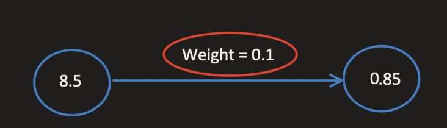

# Chapter 3
### Into to Neural Prediction: Forward Propagation

#### Predict:
 - The amount of data you feed your prediction algorithm will depend on the context for which you are running the algorithm for.
    - example: if youre trying to findout if theres a cat in an image, you need to give your algorithm all the pixels of the image.

#### Single Input Single Output Prediction:
 - Let us before exploring what a neural network is, and try to create one only by knowing the input and output.
 - We take a single input datapoint and output one prediction. With this, we can build a single knob/weight (you'll understand this in a bit) mapping from the input point to the output. 
 - Let's predict whether a baseball team will win based on the average number of toes per player.
 - With one weight, this network takes in one datapoint at a time and outputs a single prediction.


---

##### 1) an empty network


```python

    weight = 0.1
    def neural_net(input, weight):
        return input * weight

```

---

##### 2) inserting one datapoint


```python

    num_of_toes = [8.5, 9.5, 10, 9]
    input = num_of_toes[0]
    pred = neural_net(input, weight)
    print(pred)
```

---

##### 3) multiplying input by weight


```python

    def neural_net(input, weight):
        return input * weight


```

---

##### 4) multiplying input by weight


```python
    num_of_toes = [8.5, 9.5, 10, 9]
    input = num_of_toes[0]
    pred = neural_net(input, weight)

```
---

#### What is a Neural Network?
 - Until now, a nural netowrk is one or more weights that you can multiply by the input data to make a prediction

 - The Nework:
 
 ```python
 
    weight = 0.1
    def neural_net(input, weight):
        return input * weight
 ```

 - How you use the network to predict:
 ```python
 
    num_of_toes = [8.5, 9.5, 10, 9]
    input = num_of_toes[0]
    pred = neural_net(input, weight) #prints 0.85
 ```

 